# Monitoring, Observability, and GitOps

This project demonstrates Prometheus/Grafana monitoring, Kubernetes logs, and
a GitOps deployment with Argo CD.

## Monitoring demo

Monitoring answers **“Is the system healthy?”** Metrics and dashboards show
system status; alerts notify operators when a defined condition is met.

Start the demo from this directory:

```bash
cd ../04-grafana
docker compose up -d
docker compose ps
```

Open Prometheus at <http://localhost:9090> and query `up`. Open Grafana at
<http://localhost:3000>, add a Prometheus data source at
`http://prometheus:9090`, and create a visualization using `up`.

Check container resources with:

```bash
docker stats --no-stream session20-prometheus session20-grafana
```

For Kubernetes Pod metrics, run `kubectl top pods -n session20` when Metrics
Server is installed. The provided Prometheus config only scrapes Prometheus; it
does not collect application or Kubernetes metrics. The demo also does not
preconfigure alert rules or Alertmanager. A Grafana alert rule can be created
in the UI to demonstrate alert evaluation.

Check the NGINX application health:

```bash
kubectl rollout status deployment/session20-mini -n session20
kubectl port-forward -n session20 svc/session20-mini 8080:80
```

In another terminal, run `curl -I http://localhost:8080`. A successful HTTP
response and ready replicas are basic health checks.

## Observability

Observability answers **“Why is the system behaving this way?”** It combines
signals to investigate failures and performance, including issues not covered by
predefined alerts.

| Pillar | Meaning | Example |
| --- | --- | --- |
| Metrics | Numeric measurements over time | CPU, memory, request rate, errors, latency |
| Logs | Timestamped events | Startup messages, requests, errors |
| Traces | A request's journey through services, represented by timed spans | Find which service or database made a request slow |

Metrics reveal patterns, logs explain events, and traces locate delays across
service boundaries. Together they help detect degradation, find root causes,
and verify changes.

Common tools include Prometheus and CloudWatch for metrics, Grafana for
dashboards, Loki or Elastic Stack for logs, and OpenTelemetry with Jaeger or
Tempo for tracing.

### Kubernetes observability

Observe node readiness, Pod health/restarts, resource use, application logs,
and instrumented application metrics/traces. Kubernetes probes report workload
health; `kubectl logs` shows container output; `kubectl top` requires Metrics
Server. At larger scale, Prometheus/Grafana, Fluent Bit with a log backend, and
OpenTelemetry tracing are common choices.

The sample log workload can be applied and inspected with:

```bash
kubectl apply -f ../02-metrics-logs-traces/k8s-demo/
kubectl get pods
kubectl logs -f deployment/session20-demo
```

Press **Ctrl+C** to stop following logs. These sample messages are logs, not
application metrics or distributed traces.

## GitOps demo

GitOps stores the **desired state** in Git as declarative configuration.
Argo CD continuously compares it with the Kubernetes **actual state** and
reconciles differences.

```text
Commit manifests -> Git (desired state) -> Argo CD -> Kubernetes
                       ^                    |
                       +---- compare --------+
```

Workflow: change and commit manifests, Argo CD detects the revision, syncs it
to Kubernetes, then keeps reconciling drift when automated sync/self-heal is
enabled. Git provides review, history, and rollback.

In this demo, `app/deployment.yaml` was changed from 2 to 3 replicas and pushed
to the repository. Argo CD synced the change; the expected result is `3/3`
ready replicas:

```bash
kubectl get application session20-mini -n argocd
kubectl get deployment session20-mini -n session20
kubectl get pods -n session20
```

If the change does not appear, check the Application's repository, branch, and
path, then inspect it with `kubectl describe application session20-mini -n argocd`.

Manifests: [`app/deployment.yaml`](app/deployment.yaml) and
[`app/argocd-application.yaml`](app/argocd-application.yaml).

## Screenshots

### Monitoring and service health

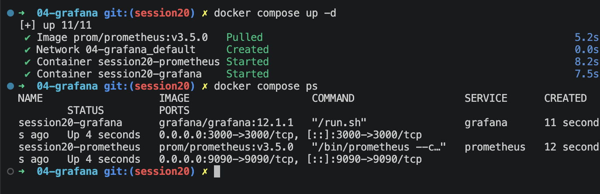
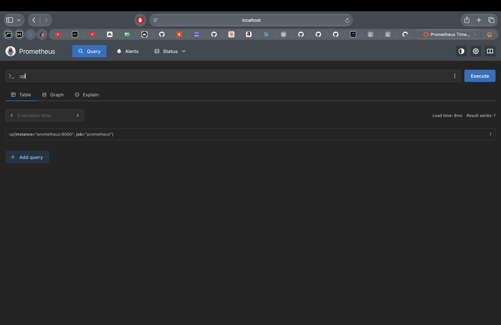
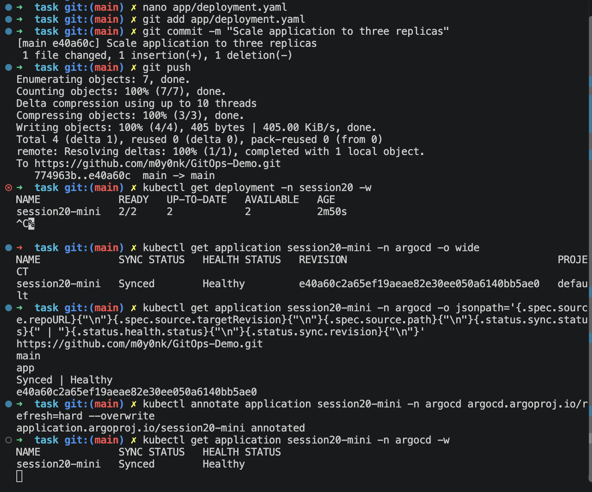
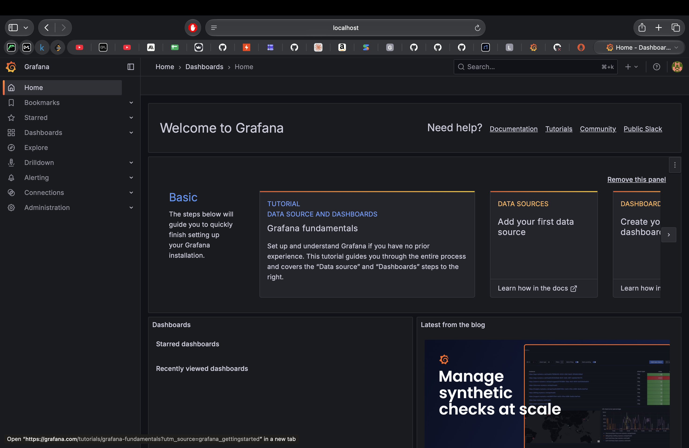
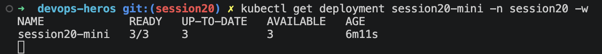

### Kubernetes and GitOps

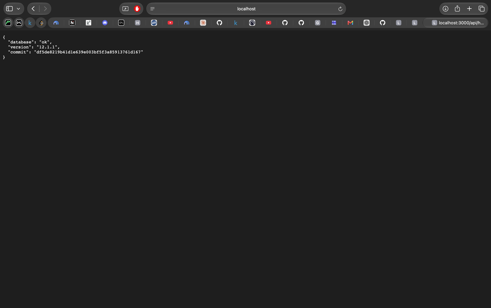
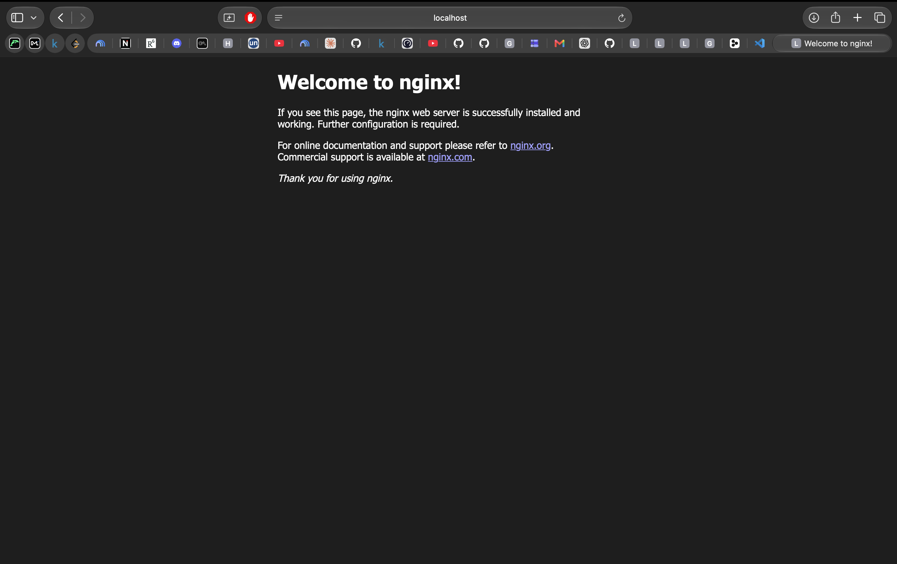
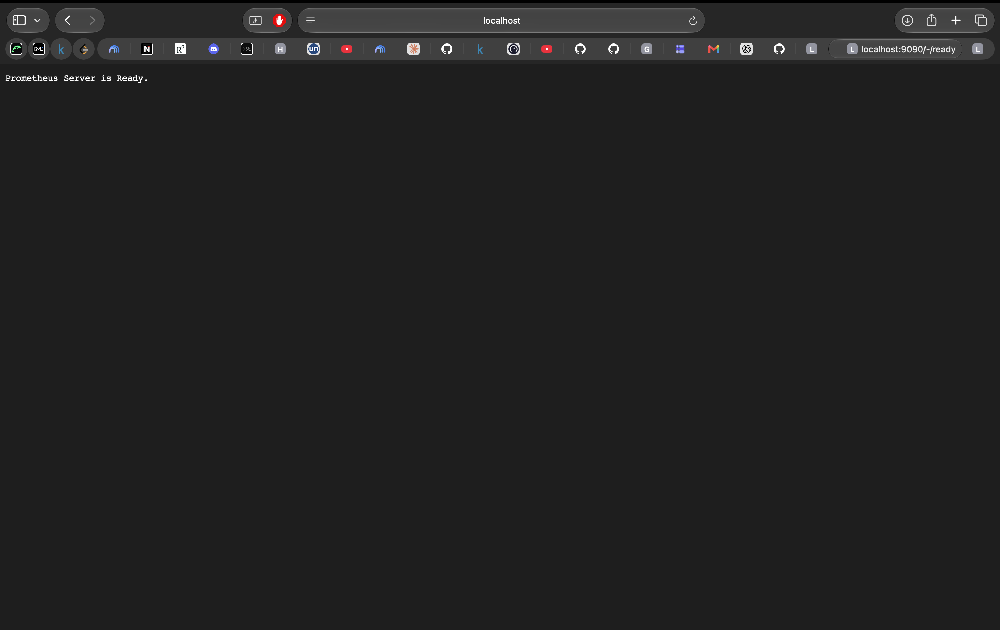
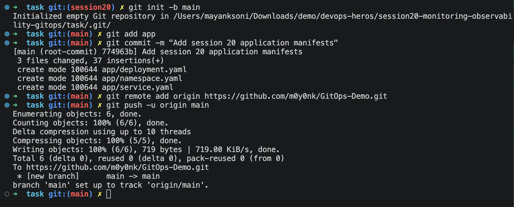
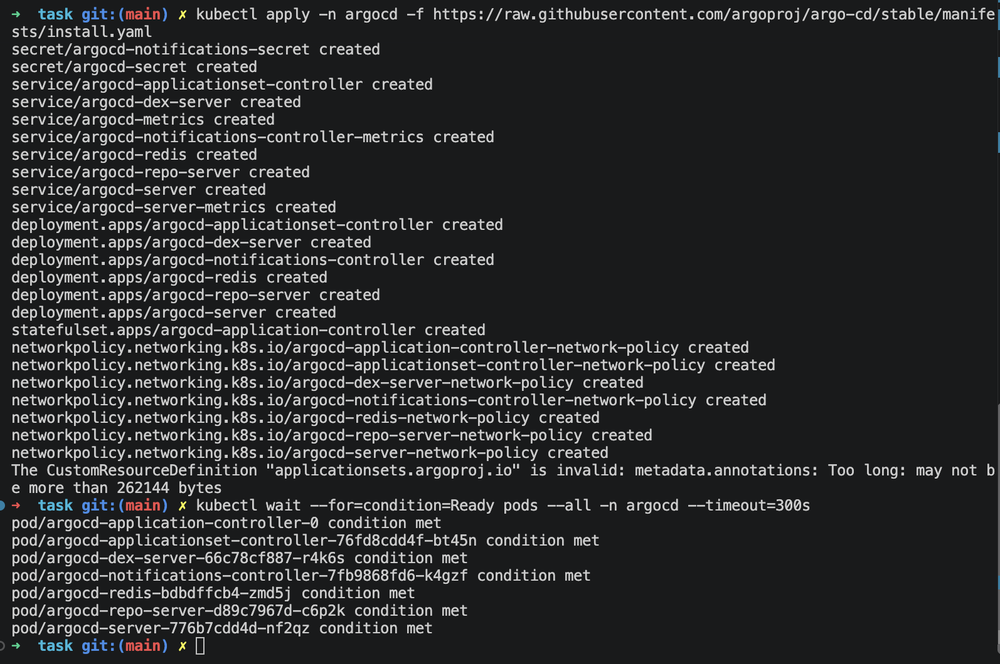
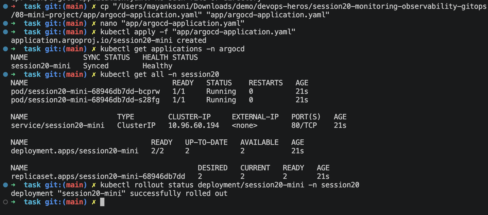
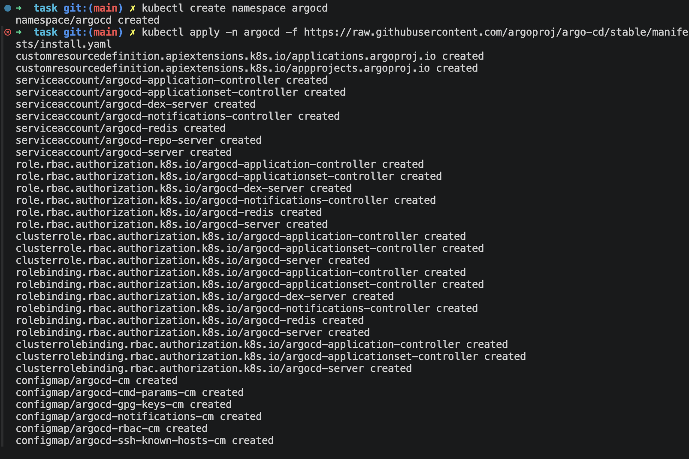
